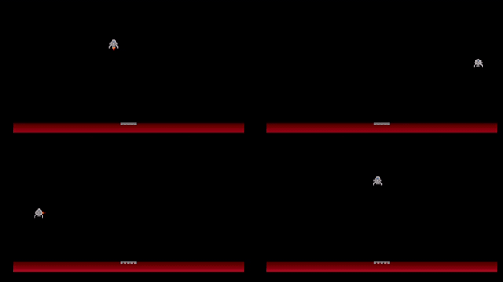
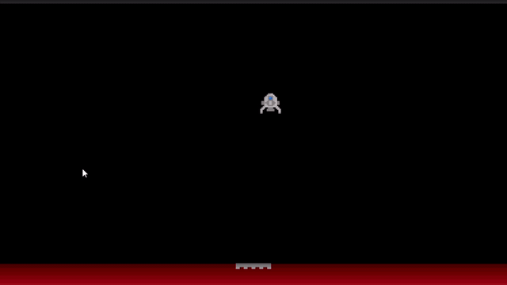

# moon-lander-unity-mlagents
A simple moon lander game AI with Unity ML Agents

## Training



In order to train the model, you need a conda environment with `python 3.6` `tensorflow 1.7.1` and `mlagents`. Once you have all that, you can go to the proyect directory and run the following command
```
mlagents-learn moon_lander_config.yml --train
```
After that, you need to open the `Train` scene in unity and hit Play.


When the training is done, this will generate a `MoonLanderLearningBrain.nn` file, which you will need later.

## Making the trained model play



To make the trained model play, open the `Play` scene in Unity, select the `MoonLanderTrainedBrain` file in assets and assign the previously generated `MoonLanderLearningBrain.nn` file to the model field. Hit Play and watch it land.
